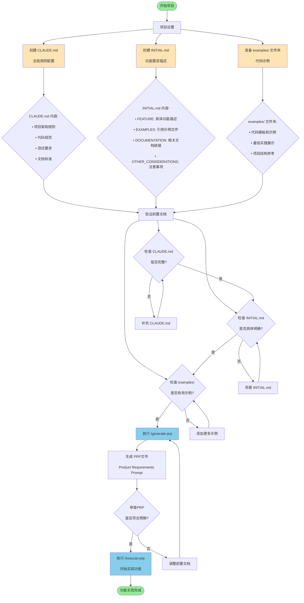

# Context Engineering 前置文档流程图

以下是 Context Engineering 项目前置文档的完整流程图，展示了从项目初始化到生成 PRP 的每个步骤：

## 前置文档详细要求

### 1. CLAUDE.md (全局规则)
- **项目架构规则**: 文件大小限制、模块组织方式
- **代码规范**: 语言偏好、格式化规则
- **测试要求**: 单元测试模式、覆盖率期望
- **文档标准**: 文档字符串格式、注释实践

### 2. INITIAL.md (功能需求)
**FEATURE部分**: 
- 具体明确的功能描述
- 包含技术栈和实现细节

**EXAMPLES部分**:
- 引用examples/文件夹中的相关文件
- 说明应该模仿的代码模式

**DOCUMENTATION部分**:
- API文档链接
- 相关库的使用指南
- MCP服务器文档

**OTHER_CONSIDERATIONS部分**:
- 认证要求
- 速率限制
- 常见陷阱
- 性能要求

### 3. examples/ 文件夹
- **代码模板**: 可作为起点的代码文件
- **最佳实践**: 展示项目约定的代码模式
- **项目结构**: 展示推荐的文件和目录组织方式

## 使用流程

1. **项目初始化**: 按照流程图设置CLAUDE.md、INITIAL.md和examples/
2. **验证检查**: 确保所有前置文档完整且质量良好
3. **生成PRP**: 使用 `/generate-prp INITIAL.md` 命令
4. **审查调整**: 检查生成的PRP，必要时调整前置文档
5. **执行实现**: 使用 `/execute-prp PRPs/your-feature.md` 命令实现功能

这个流程确保了AI助手有足够的上下文信息来端到端地完成任务，减少失败率并确保一致性。